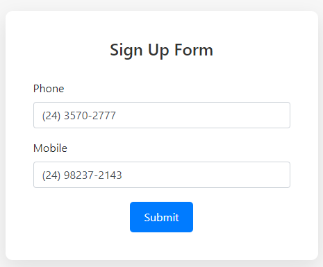

# Intelia Technical Test - Register Form Application

Esta é uma aplicação simples de formulário de registro, construída com **Symfony** no backend e **Vue.js** no frontend.

## 

## Requisitos

Certifique-se de que você tem as seguintes dependências instaladas:

- **PHP 8.0+**
- **Composer**
- **Node.js** (versão 14.x ou superior)
- **MySQL** ou outro banco de dados compatível com Doctrine

## Instalação

Siga os passos abaixo para configurar o ambiente de desenvolvimento.

### 1. Clone o repositório

```bash
git clone https://github.com/71Kevin/intelia-technical-test.git
```

### 2. Instale as dependências do PHP

Navegue até o diretório do projeto e execute o comando abaixo para instalar as dependências do backend (Symfony):

```bash
composer install
```

### 3. Instale as dependências do Node.js

Execute o comando abaixo para instalar as dependências do frontend (Vue.js):

```bash
npm install
```

### 4. Configure o banco de dados

Crie o banco de dados e o usuário conforme o comando abaixo:

```sql
CREATE DATABASE register_form CHARACTER SET utf8 COLLATE utf8_general_ci;

CREATE USER 'register_form'@'localhost' IDENTIFIED BY 'register_form';
GRANT ALL PRIVILEGES ON register_form.* TO 'register_form'@'localhost';
```

### 5. Aplique as migrações

Após configurar o banco de dados, rode as migrações para criar as tabelas necessárias:

```bash
php bin/console doctrine:migrations:migrate
```

### 6. (Opcional) Rebuild do Frontend

Se você realizar alterações no código Vue, pode ser necessário recompilar o frontend. Use o seguinte comando para gerar o bundle:

```bash
npx webpack
```

## Uso

### 1. Inicie o servidor local

```bash
php -S 127.0.0.1:8000 -t public
```

### 2. Acesse no navegador

Abra o navegador e navegue até:

```
http://127.0.0.1:8000/
```

## Scripts para Desenvolvimento

- **Rodar servidor de desenvolvimento do Vue**:
  ```bash
  npm run serve
  ```

- **Build do frontend para produção**:
  ```bash
  npm run build
  ```

## Rodando a aplicação via Docker

Se preferir subir a aplicação utilizando Docker, siga os passos abaixo:

### 1. Subindo a aplicação via Docker

Com o Docker instalado, execute os seguintes comandos para subir a aplicação:

#### Localmente:

```bash
bash deploy.sh local deploy
```

#### Em um servidor remoto:

```bash
bash deploy.sh remote deploy
```

Esse script automatiza a criação do container e a execução da aplicação, seja local ou remotamente.

### 3. Acessando a aplicação

Após subir o container, acesse a aplicação no seu navegador:

```
http://127.0.0.1:8000/
```
